## Experiments concering Unpaired Image to Image Translation with Limited Data
Simple prototypes of common ML concepts

### Effect of Number of Instances on DC-GAN

#### FashionMNIST

Class | 10 | 100 | 1000
:---: | :---: | :---: | :---: |
T-Shirt/Top |  | 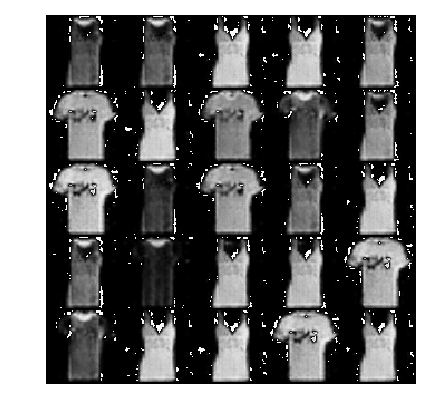 |  
Trouser | 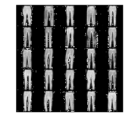 | 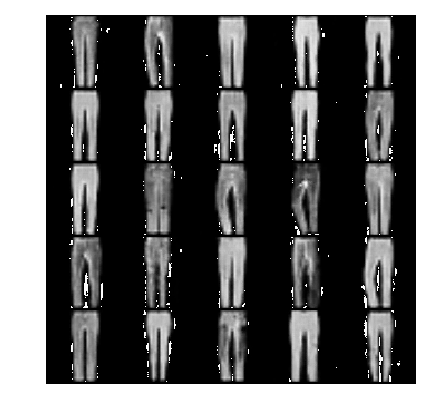 |  
Pullover | 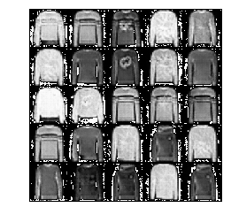 |  | 

#### MNIST

Class | 10 | 100 | 1000
:---: | :---: | :---: | :---: |
'1' | 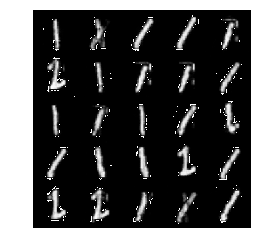 |  | 
'2' |  |  | 
'3' | 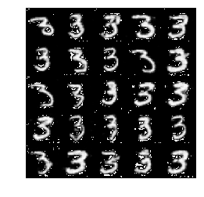 |  | 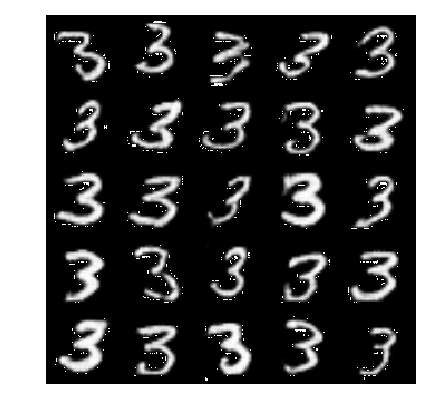

#### notMNIST
Class | 10 | 100 | 1000 |
:---: | :---: | :---: | :---: |
'B'|  |  |  
'C' |  | 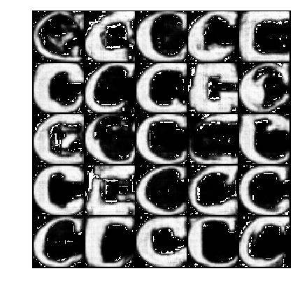 |  
'D' |  |  |  

### Effect of number of Instances of Target Domain on Cycle GAN 

#### MNIST

Source | Target | 10 | 100 | 1000
:---: | :---: | :---: | :---: | :---: |
'1' | '7' | 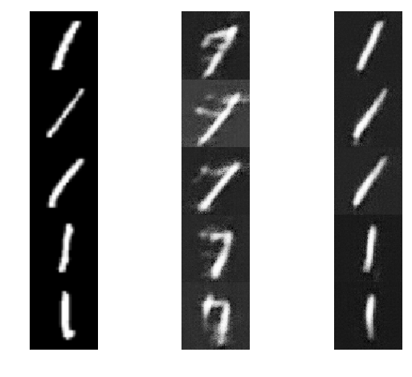 | 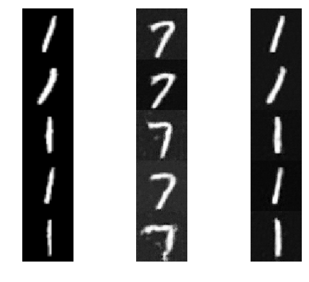 | 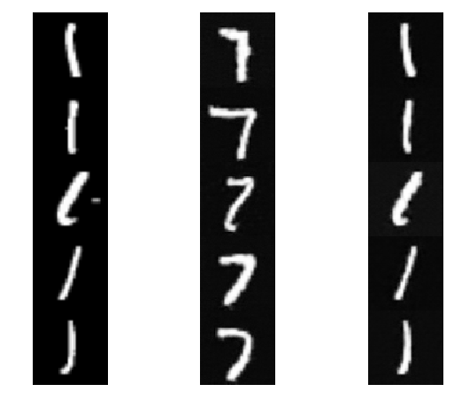
'3' | '8' |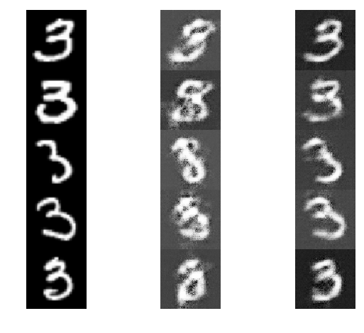 | 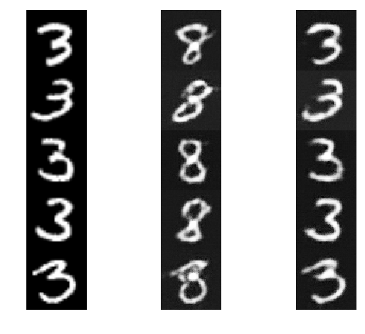 | 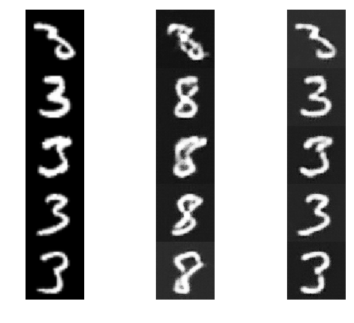
'6' | '9' |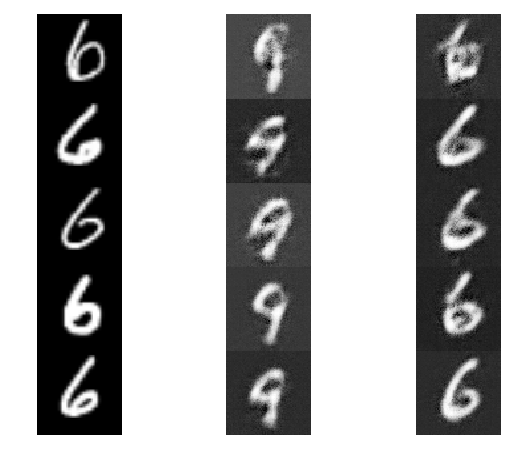 | 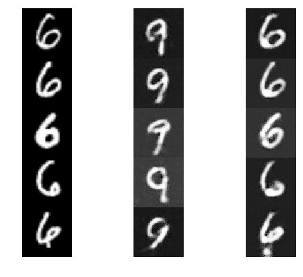 | 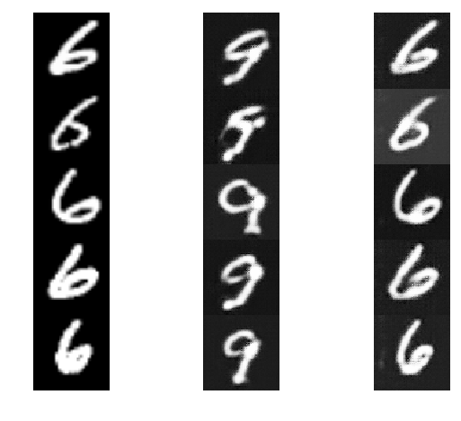

#### FashionMNIST

Source | Target | 10 | 100 | 1000
:---: | :---: | :---: | :---: | :---: |
Sneaker | Ankle Boot | 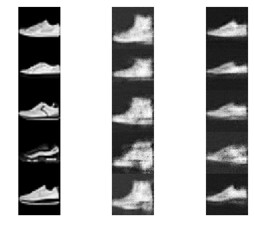 | 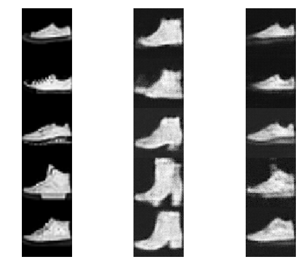 | 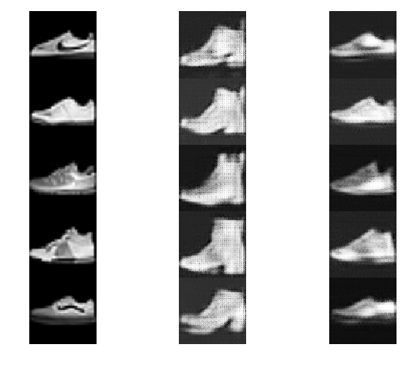
Sneaker | Bag | 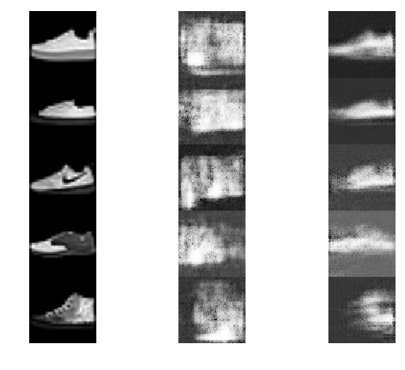 | 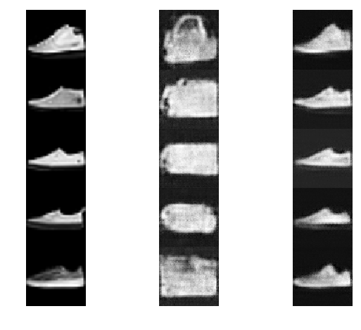 | 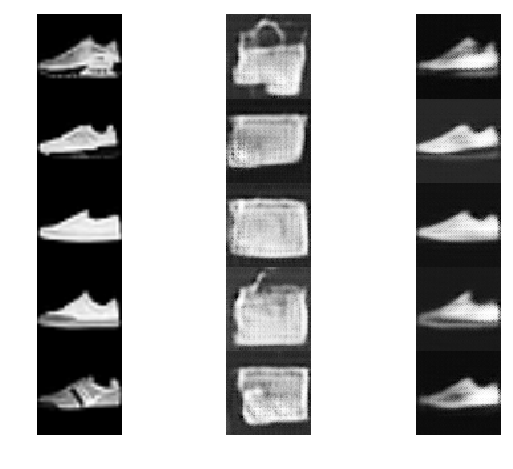

#### notMNIST

Source | Target | 10 | 100 | 1000
:---: | :---: | :---: | :---: | :---: |
Sneaker | Bag |  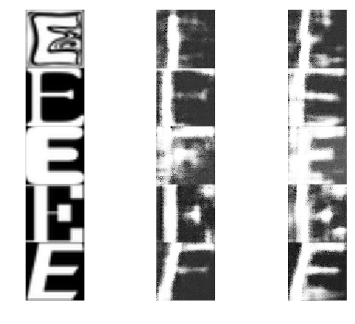 | 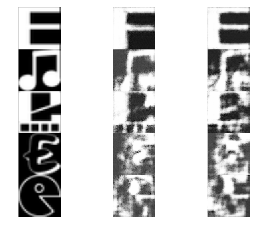 | 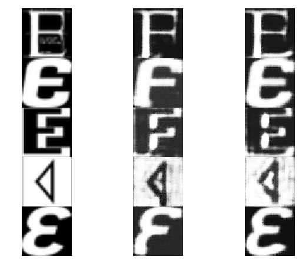

