## Using Domain Adaptation for Few Shot Generative Modeling 

### Effect of Number of Instances on DC-GAN

#### FashionMNIST

Class | 10 | 100 | 1000
:---: | :---: | :---: | :---: |
T-Shirt/Top | 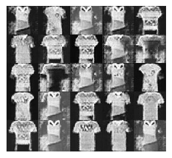 | 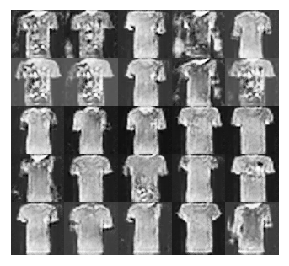 | 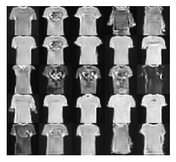 
Trouser | 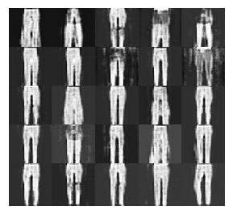 | 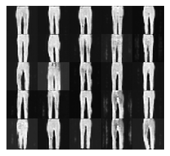 | 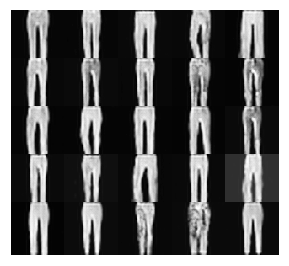 
Pullover | 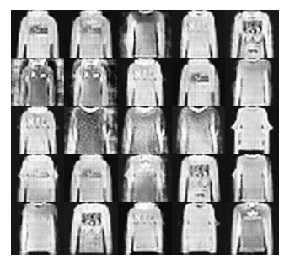 | 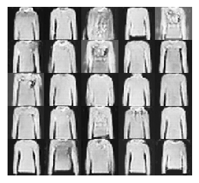 | 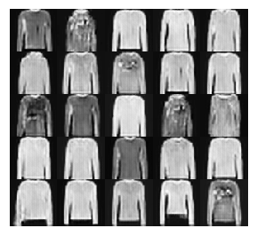

#### MNIST

Class | 10 | 100 | 1000
:---: | :---: | :---: | :---: |
'1' | 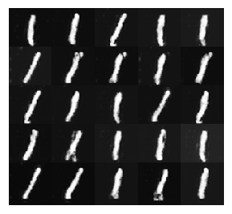 | 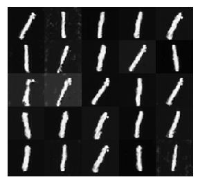 | 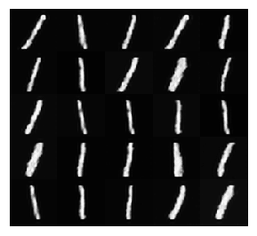
'2' | 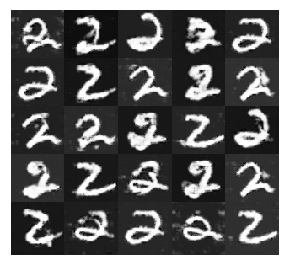 | 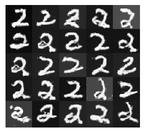 | 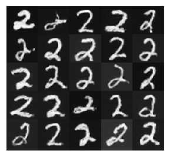
'3' | 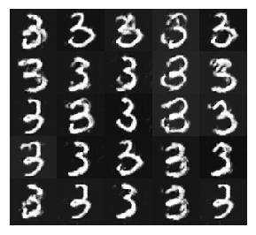 | 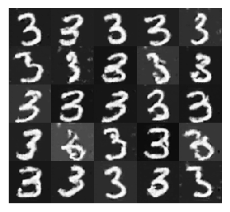 | 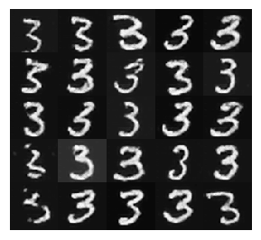

#### notMNIST
Class | 10 | 100 | 1000 |
:---: | :---: | :---: | :---: |
'B'| 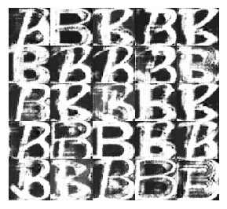 | 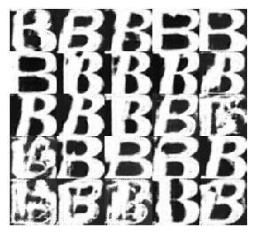 | 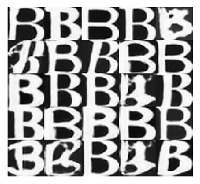 
'C' | 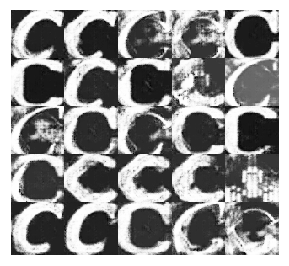 | 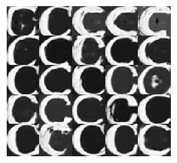 | 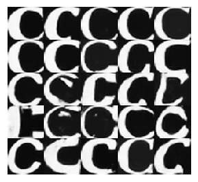 
'D' | 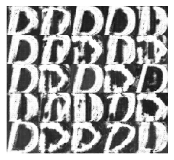 | 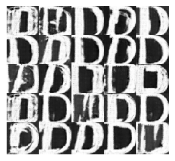 | 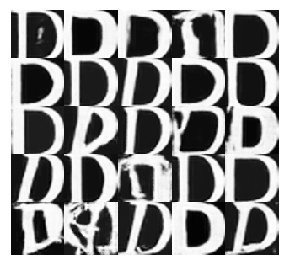 

### Effect of number of Instances of Target Domain on Cycle GAN 

#### MNIST

Source | Target | 10 | 100 | 1000
:---: | :---: | :---: | :---: | :---: |
'1' | '7' |  |  | 
'3' | '8' | |  | 
'6' | '9' | |  | 

#### FashionMNIST

Source | Target | 10 | 100 | 1000
:---: | :---: | :---: | :---: | :---: |
Sneaker | Ankle Boot |  |  | 
Sneaker | Bag |  |  | 

#### notMNIST

Source | Target | 10 | 100 | 1000
:---: | :---: | :---: | :---: | :---: |
Sneaker | Bag |   |  | 

### Evaluation 

#### Confusion Matrix

Train Dataset | Test Dataset | 10 | 100 | 1000
:---: | :---: | :---: | :---: | :---: |
MNIST GAN | MNIST Real | 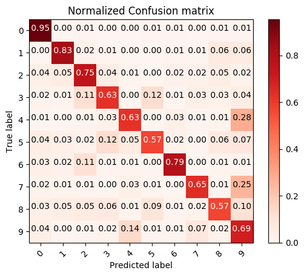 | 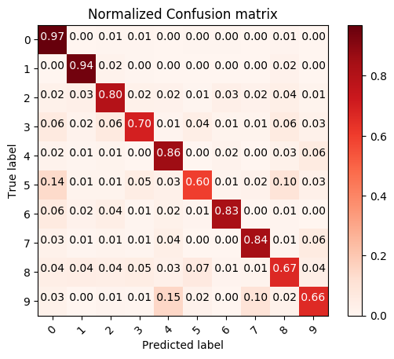 | 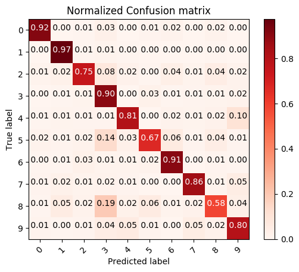
FashionMNIST GAN  | FashionMNIST Real | 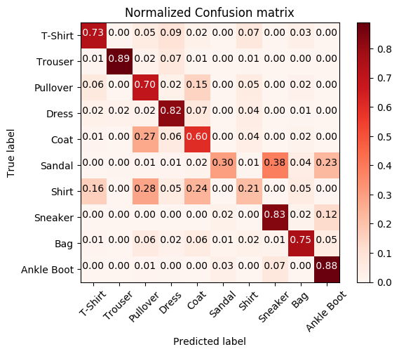 |  | 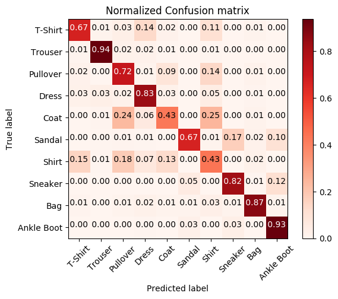
notMNIST GAN  | notMNIST Real | 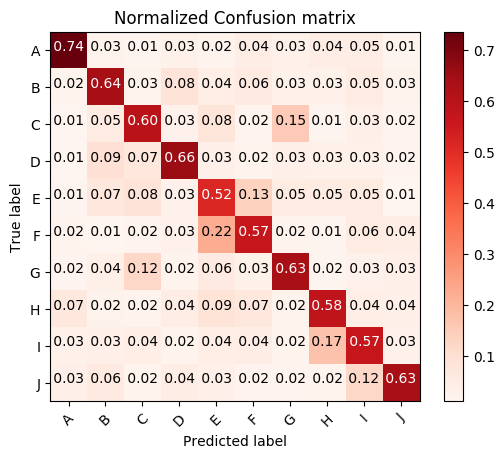 | 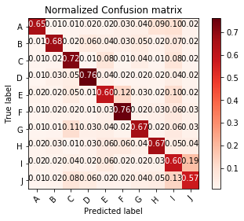 | 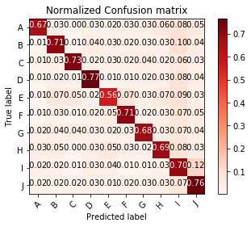
MNIST Real | MNIST Real | 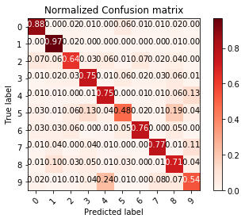 | 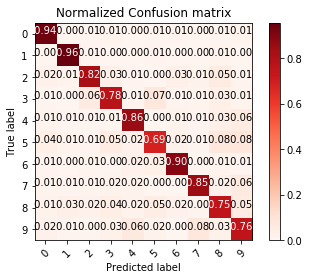 | 
FashionMNIST Real | FashionMNIST Real | 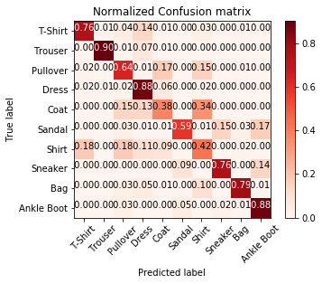 |  | 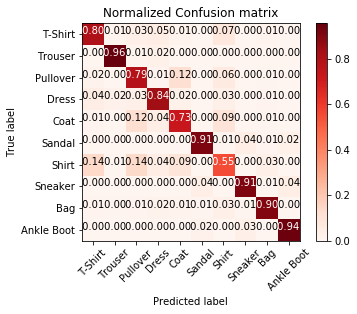
notMNIST Real | notMNIST Real | 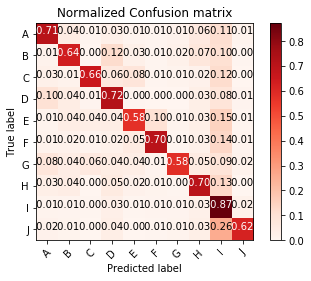 | 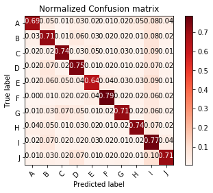 | 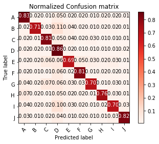

#### Visualization

Train Dataset | 10 | 100 | 1000 
:---: | :---: | :---: | :---:
MNIST | 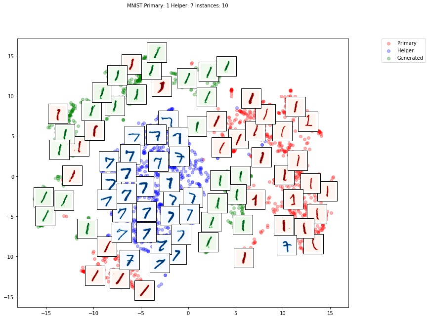 |  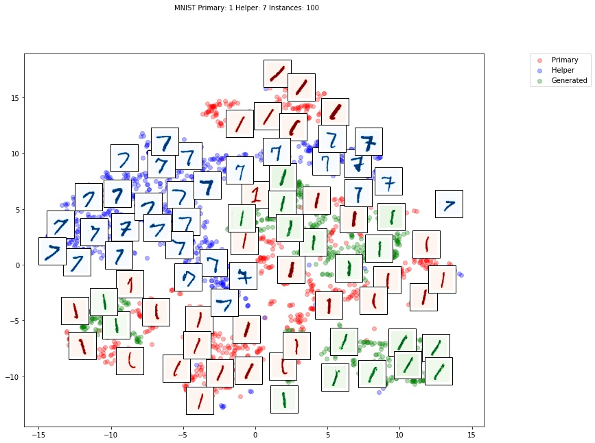 |  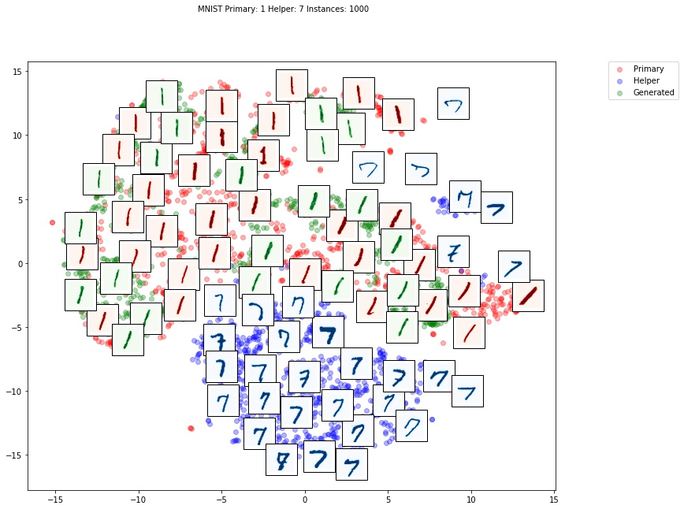
FashionMNIST |  |   |  
notMNIST | 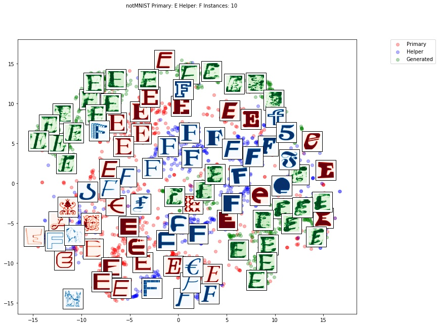 |  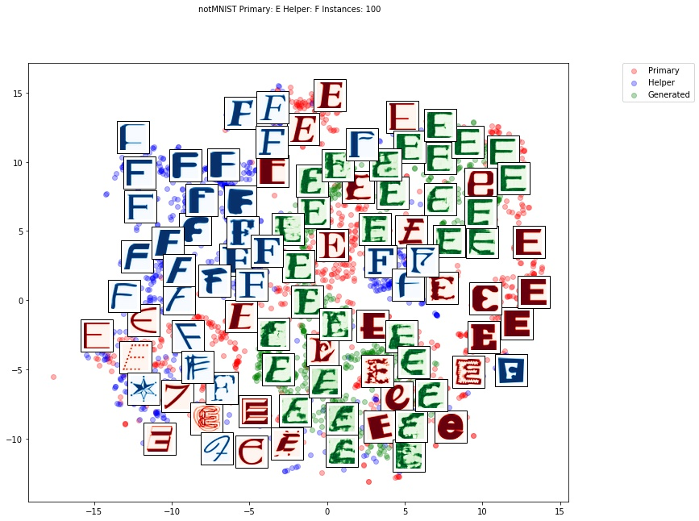 |  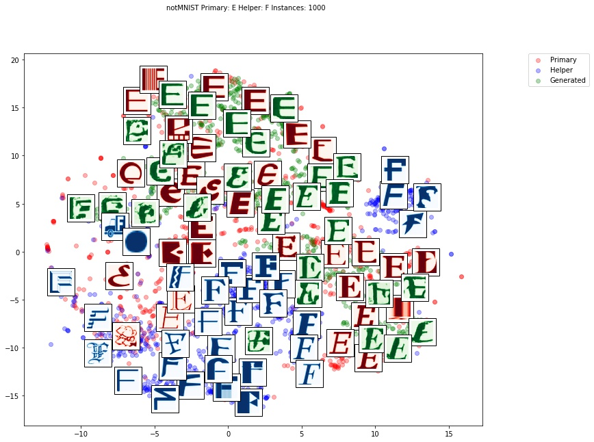

### Class/Domain distance

#### Within-domain distance 

Dataset| Ex1 | Ex2 | Ex3
:---: | :---: | :---: | :---:
MNIST | 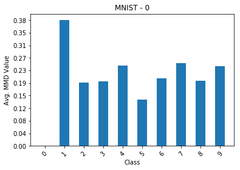 | 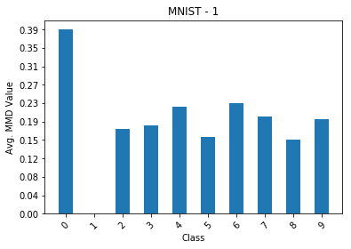 |  
FashionMNIST |  |  |  
CIFAR |  |  |  

#### Cross-domain distance

Primary Domain | Helper Domain | Ex1 | Ex2 | Ex3 
:---: | :---: | :---: | :---: | :---:
MNIST | SVHN-BW  |  |  |  
MNIST | USPS  |  |  |  

## Usage

#### Generating examples in Regular and Few-Shot Scenarios

- Execute the conditional DC-GAN with `python cDCGAN_train.py`. This would create 4 directories within `DCGAN` folder
	- `DCGAN/animation` containing gif of generated images after every epoch
	- `DCGAN/loss` containing loss values for both generator and discriminator vs. epochs
	- `DCGAN/plots` containing a png file with generated images after last epoch
	- `DCGAN/models` containing model file with discriminator and generator weights in pytorch format

#### Computing Domain Distance 

- Execute the Maximum Mean Discrepancy comparison with `python MMD_WD.py`. This would create 1 directory withing `DCGAN` folder
	- `DCGAN/mmdValues` containing histograms of average MMD values vs. Classes for a single domain (dataset)
- Execute the MMD comparison with `python MMD_CD.py`. This would create 1 directory within `DCGAN` folder
	- `DCGAN/mmdValues` containing histograms of average MMD values vs. Classes for two different domains (datasets)

#### Evaluation

- Classification of test data with training data being one of the three 
	- Real data instances from original dataset
	- Real data + Data generated by DC-GAN 
	- Real data + Data generated by DC-GAN using MMD distance as a proxy for training 
	- Classification using SVF with RBF kernel
- Execute `Evaluate/classify.py`
	- Primary class is a single class within a domain say MNIST
	- Helper class is another fixed class within the same domain
	- Results in `Evaluate/MMD`

MNIST | F-MNIST | CIFAR | SVHN
:---: | :---: | :---: | :---: 
 |   |   |    

- Execute `Evaluate/classify_CD.py`
	- Primary class is a single class within a domain say MNIST
	- Helper class is another class in a different helper domain say SVHN
	- Results in `Evaulate/crossDomainMMD`

MNIST | F-MNIST | CIFAR | SVHN
:---: | :---: | :---: | :---: 
 |   |   |   

- Execute `Evaluate/classify_all.py`
	- Primary class is  a single class within a domain say MNIST
	- Helper class are all the classes except the primary class  withing same domain
	- Results in `Evaulate/MMDall`

MNIST | F-MNIST | CIFAR | SVHN
:---: | :---: | :---: | :---: 
 |   |   |   

- Execute `Evaluate/classify_all_CD.py`
	- Primary class is a single class withing a domain say MNIST
	- Helper classes are all the classes in a different helper domain say SVHN
	- Results in `Evaulate/crossDomainMMDall`

MNIST | F-MNIST | CIFAR | SVHN
:---: | :---: | :---: | :---: 
 |   |   |  

### References 

- [MNIST](http://yann.lecun.com/exdb/mnist/)
- [FashionMNIST](https://github.com/zalandoresearch/fashion-mnist) dataset
- [notMNIST](https://github.com/davidflanagan/notMNIST-to-MNIST) dataset
- GAN [Tutorial](https://github.com/yunjey/pytorch-tutorial/blob/master/tutorials/02-intermediate/generative_adversarial_network/main.py)
- CycleGAN [Implementation](https://github.com/togheppi/CycleGAN)

### TODO

- [ ] Add classification results for DCGAN with/without MMD 
- [x] DCGAN with MMD [ Learning from all classes of same dataset ]
- [ ] MMD Comparison [ Cross and within domain ]
- [ ] Batches with max and min MMD
- [ ] Update .py files [presently in .ipynb format]

